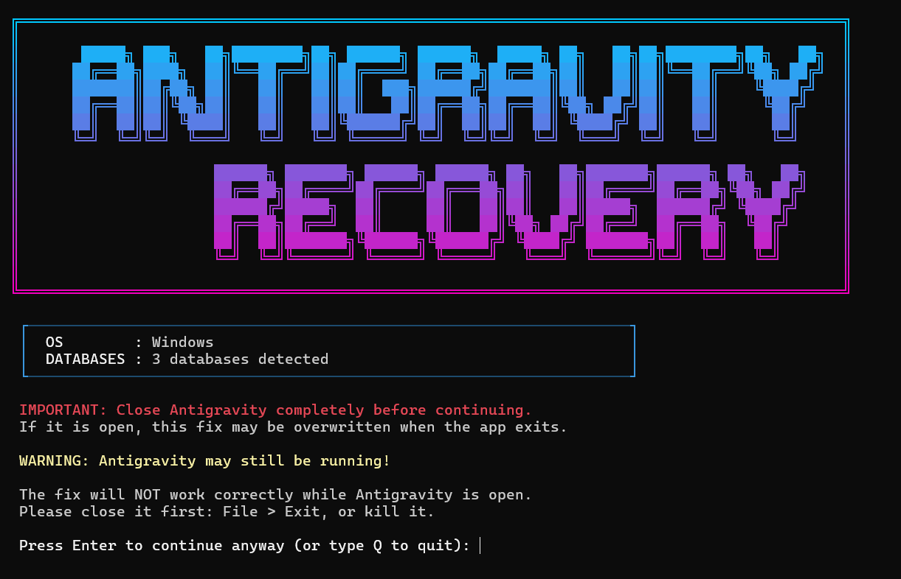

# Antigravity Conversation Recovery

Your Antigravity conversation history disappeared? Conversations showing in the wrong order? Titles replaced with placeholder text? Workspace assignments lost? This tool fixes all of that.

## Terminal Interface



## Quick Start (Windows)

1. **Close Antigravity** completely (File → Exit or kill from Task Manager)
2. Download **`Antigravity_Conversation_Recovery.exe`** from the [Releases](../../releases) page
3. Double-click it — a terminal window will open
4. The tool scans your conversations, rebuilds the index, and shows you the results
5. When prompted for workspace assignment, choose an option:
   - **Press Enter or 1** — auto-assigns workspaces from your brain files *(recommended)*
   - **Press 2** — auto-assigns first, then lets you manually assign any remaining conversations
6. Restart your PC, then open Antigravity — your conversations are back, sorted by date

> **No Python or developer tools required.** Just download, run, done.

## What It Fixes

| Problem | Status |
|---|---|
| Conversations missing from sidebar | Fixed |
| Conversations in wrong order | Fixed (Sorted newest first) |
| Placeholder titles instead of real names | Fixed (Restores from brain artifacts) |
| Titles lost after previous fix attempts | Fixed (Preserves existing titles) |
| Workspace assignments stripped on rebuild | Fixed (Preserves workspace metadata) |
| Lost workspace assignments | Fixed (Auto-recovers from brain artifacts) |
| Missing timestamps causing wrong sort | Fixed (Injects timestamps from file dates) |
| Remote workspaces (WSL/SSH/Docker) not recognized | Fixed (Full vscode-remote:// support) |
| "Antigravity IDE" renamed folder not detected | Fixed (Auto-detects both old and new paths) |
| Antigravity IDE 2.x data folder | Fixed (Auto-detects all naming variants) |
| Conversations split across multiple folders after upgrade | Fixed (Multi-folder merge with dedup) |
| Only one Antigravity variant fixed when both installed | Fixed (Writes index to ALL databases) |
| New .db conversation format not detected | Fixed (Supports both .pb and .db files) |
| Running from WSL requires manual file copying | Fixed (Native WSL path detection) |
| python command fails on macOS/Linux | Fixed (Auto-detects Python 3, with built-in fallback) |

## How It Works

Antigravity stores conversation data in two places:

- **Conversation files** (`*.pb` or `*.db`) — stored in your user profile
- **Sidebar index** — a SQLite database in your app data folder (one per Antigravity variant)

| OS | Conversations | Database |
|---|---|---|
| Windows | `%USERPROFILE%\.gemini\antigravity\` or `antigravity-ide\` | `%APPDATA%\Antigravity IDE\...\state.vscdb` |
| macOS | `~/.gemini/antigravity/` or `antigravity-ide/` | `~/Library/Application Support/Antigravity IDE/.../state.vscdb` |
| Linux | `~/.gemini/antigravity/` or `antigravity-ide/` | `~/.config/Antigravity IDE/.../state.vscdb` |
| WSL | `~/.gemini/antigravity/` or `antigravity-ide/` | Auto-resolved from Windows `%APPDATA%` via `/mnt/c/` |

> **Note:** The tool automatically detects all folder name variants — `antigravity`, `antigravity-ide`, `antigravity-backup`, `Antigravity`, and `Antigravity IDE` — and merges conversations from all locations. Duplicates are automatically removed (newest location wins).

When the index gets corrupted, conversations still exist on disk but don't show up in the sidebar. This tool scans your conversation files, sorts them by date, pulls titles from brain artifacts, and writes a clean index back to the database.

**Title resolution priority:**
1. Titles already in the database (canonical Antigravity titles — preserved across re-runs)
2. Brain artifact `.md` headings (for conversations not yet indexed)
3. Fallback: `Conversation (date) short-id`

## Output Legend

| Marker | Meaning |
|---|---|
| `[+]` | Title extracted from brain artifact |
| `[~]` | Title preserved from existing database |
| `[?]` | Fallback title (no source available) |
| `[WS]` | Workspace metadata preserved or recovered |

## Advanced: Run from Source (Mac / Linux / Windows)

If you prefer running the Python script directly, or if you are on **Mac** or **Linux** (which cannot run `.exe` files):

```bash
# Windows
python rebuild_conversations.py

# macOS / Linux
python3 rebuild_conversations.py
```

> **Why python3?** On macOS 12.3+ and most Linux distros, the `python` command either doesn't exist or may point to an old Python 2 installation. Use `python3` to be safe. If you're unsure which you have, run `python3 --version` in your terminal.

> **Automatic fallback:** If you accidentally run the script with Python 2 (e.g. `python rebuild_conversations.py` on a system where `python` is Python 2), the script will detect this and automatically re-launch itself with `python3`. If Python 3 isn't installed at all, it will print a clear error with install instructions.

Requires Python 3.7+ with no external packages. The script automatically detects your operating system and finds the correct folders (both old and new naming conventions).

### WSL Users

The script natively supports WSL — just run it directly from your WSL terminal:

```bash
python3 rebuild_conversations.py
```

The tool automatically detects WSL, resolves your Windows `%APPDATA%` path, and accesses the Antigravity database on the Windows side. No manual file copying needed.

> **How it works:** The script calls `cmd.exe /c echo %APPDATA%` and converts the result with `wslpath`. If that fails, it scans `/mnt/c/Users/` for folders that have Antigravity installed. Conversations and brain data are read from your Linux home directory (`~/.gemini/antigravity/`).

## Safety

- **Automatic backup** — your current index is saved to `trajectorySummaries_backup.txt` before any changes
- **Non-destructive** — conversation files (`*.pb`) are never modified, only the sidebar index is rebuilt
- **Metadata-preserving** — workspace assignments, timestamps, and other internal state are retained
- **Idempotent** — safe to run multiple times

Warning: Antivirus false positive: The .exe may be flagged only by 2 out of 72 engines on VirusTotal — both low-tier (SecureAge, Bkav). This is a known PyInstaller false positive: the bundler extracts Python to a temp folder at runtime, which triggers generic heuristic rules. All major engines (Windows Defender, Kaspersky, ESET, Bitdefender, Norton, etc.) pass it as clean. The source code is fully open — review it yourself if in doubt, or simply use the .py version.

## FAQ

**Q: Do I really need to restart my PC?**
A: A full restart is the safest way to ensure Antigravity picks up the changes. In most cases, simply closing and reopening Antigravity works too.

**Q: Why do some titles show as "Conversation (Mar 10) abc12345"?**
A: Those conversations don't have brain artifacts, and their original titles weren't in the database. Future re-runs will preserve any titles the app generates going forward.

**Q: Can I run this while Antigravity is open?**
A: The tool will detect if Antigravity is running and warn you. It's recommended to close it first so the app doesn't overwrite your fix when it exits.

**Q: I lost my workspace chats after a rebuild. Can I get them back?**
A: Yes! The tool can auto-recover most workspace assignments by scanning your brain artifact files. When prompted, press Enter or 1 for auto-assignment. If some conversations can't be auto-detected, choose option 2 to manually assign them.

**Q: I use WSL / SSH / Docker remote workspaces. Will this work?**
A: Yes! vscode-remote:// URIs are fully supported. The script can also be run natively from inside WSL without manual file copying.

**Q: I updated Antigravity and the folder name changed. Will the tool still work?**
A: Yes! The tool automatically detects all folder naming conventions (including new folder structures) and uses whichever exists on your system.

## License

MIT — free to use, share, and modify.

---

**If this fixed your conversations, please [star the repo](https://github.com/khalidsaifullah-ks/antigravity-converstation-recovery) so others can find it!**

